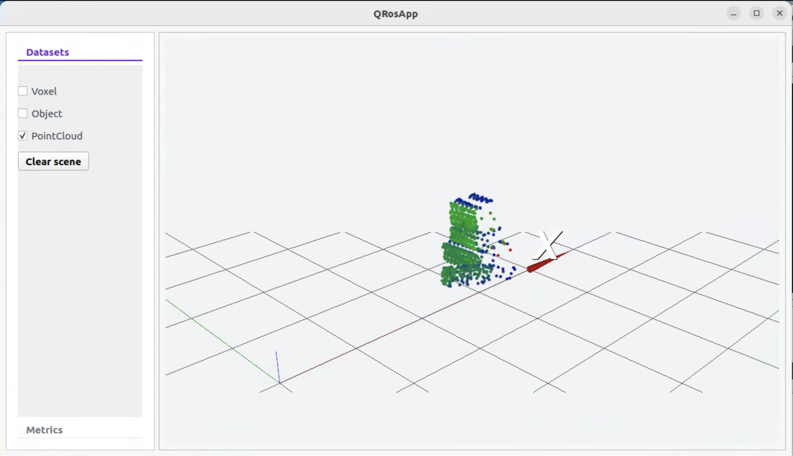
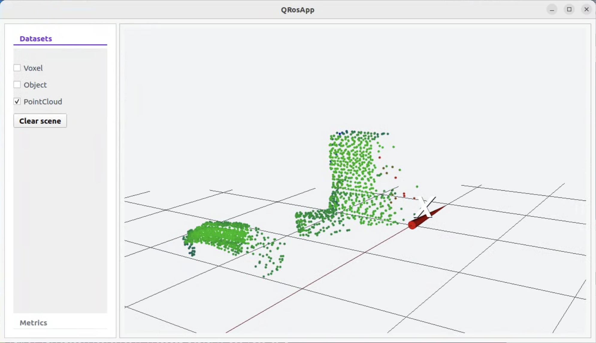
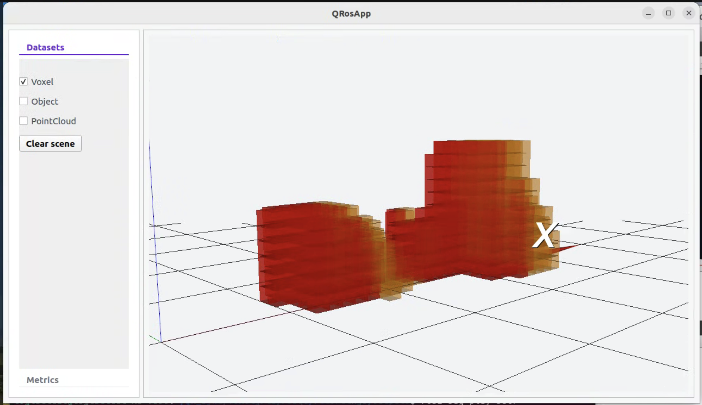
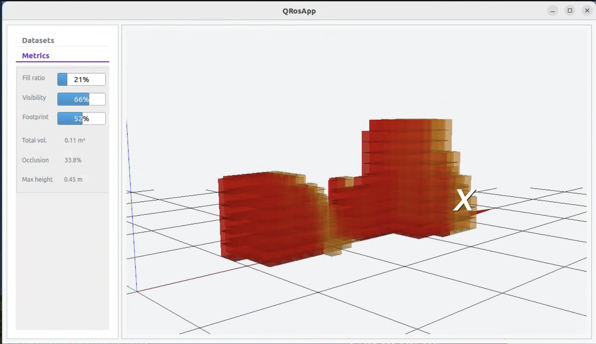

# LiDAR Visualization Module — ROS2 + Qt + VTK

**Context:** 3D visualization module developed during my collaboration with [Logistical](https://www.linkedin.com/company/logistical-japan) (Tokyo, [logistical.jp](https://logistical.jp/)), a company building freight-consolidation software for B2B shippers in Japan — combining smaller shipments into shared truckloads to cut costs and delivery times.

Logistical runs several products (delivery apps, an AI chatbot, and others); I worked specifically on their **truck-loading optimization tool**, the one project built in C++/ROS2, focused on estimating cargo volume and occupancy from LiDAR data.

> Repo: [github.com/Logistical-dev/visualpoint](https://github.com/Logistical-dev/visualpoint) — private, as it depends on the company's proprietary ROS2 framework. Feel free to reach out to them directly, or to me for more details. This README documents and showcases the work I did.

---

## What it does

The application connects to an existing ROS2 pipeline and renders in real time, in 3D:

- **Point clouds** — LiDAR point clouds colored by intensity
- **Voxels** — volumetric occupancy grid
- **Object detections** — detected object markers

It also displays live metrics (fill ratio, visibility, footprint, total volume, occlusion, max height) computed by the perception pipeline.

| | |
|---|---|
|  |  |
|  |  |

---

## My role
At first I considered Foxglove for the visualization layer, but the team needed a fully customizable interface (custom metrics panel, filtering controls, specific interactions), so I built it with Qt + VTK instead.

I worked on the **C++/Qt/VTK visualization layer**, integrating it with an existing ROS2 pipeline (sensors, object detection, voxelization) built by the team. Specifically, I built:

- **`PointCloudRenderer`** — converts `sensor_msgs::PointCloud2` messages into VTK geometry. Includes a custom lookup table mapping intensity → color, with dynamic color range calculation per frame.
- **`MarkerRenderer`** — manages the lifecycle of VTK actors (creation, pose/color updates, deletion) from `visualization_msgs::MarkerArray` messages, reused for both voxels and object detections.
- **`The Qt interface itself`**, built with Qt Designer: a left panel with checkboxes to filter each data type (point cloud, voxels, objects), a `clear scene` action, and a metrics panel with progress bars and live values driven by the incoming pipeline messages.
- **`VTK viewport integration`**: embedded a `QVTKOpenGLNativeWidget` inside the Qt layout to host the 3D scene, wired it to `MainWindow` (camera auto-framing based on scene bounds, render triggers on checkbox toggle, double-click-to-fit-view).
- Consumed a thread-safe mailbox system (built by the project's lead dev) to receive ROS2 data on the Qt main thread without blocking rendering.
  

## Tech stack

`C++` · `Qt` (QMainWindow, QVTKOpenGLNativeWidget) · `VTK` (actors, mappers, lookup tables) · `ROS2` (rclcpp, subscriptions, custom msg types) · `CMake`

---
